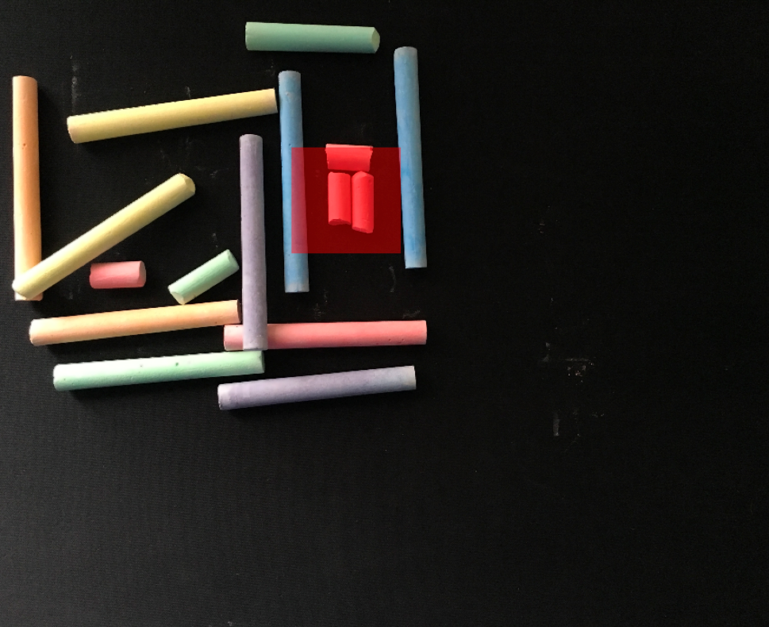

# Image Comparasion
Finding and highlighting the areas that are difference between 2 images (images can be of different size)
The objective of this project is to take two images and highlight any differences that the image have. The solution should be able to spot the difference between two photographed images, of different scale, positioning, rotation and lighting.

##### The following examples are the outputs given by the python script, two images are taken in and the detected differences is highlighted in red.
<h1 align="center" > Example 1</h1>

In this example there is no major difference between the images other than a chip being present in one of them, which has been succesfully detected.

 
 

 
 
<h1 align="center" > Example 2</h1>

We detect the difference in this image with lighting conditions being different in both images (The left image contains a lot of flash). The objects in the image are at different scales and one is slightly rotated.

 
 

 
 
<h1 align="center" > Example 3</h1>

This example shows the difference being detected when the changes in the image are in completely different locations.

 
 

 
 

### Documentation describes how we managed to detect the changes in the images.

